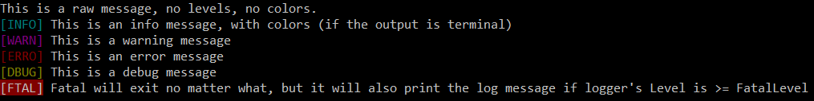

# ✒️ golog

_golog_ is a simple, fast and easy-to-use level-based logger written entirely in [GoLang](https://golang.org).



[](https://travis-ci.org/kataras/golog)
[](http://goreportcard.com/report/kataras/golog)
[](https://godoc.org/github.com/kataras/golog)
[](https://github.com/kataras/golog/issues?q=is%3Aopen+is%3Aissue)
<!-- [](https://github.com/kataras/golog/issues) -->

### 🥇 Features

* Focus on high performance and agile perspective of things
* Easy API and a default package-level instance, i.e `golog#Fatalf/Errorf/Warnf/Infof/Debugf`
* Fully compatible with the standard library
* Thanks to the [pio library](https://github.com/kataras/pio) it supports any type of structure, gives you the ability to `Hijack` and `Handle` or `Intercept` the on-going logs too 
* Set or even Add unlimited number of output targets, `io.Writer`
* Scan from any `io.Reader` and log to the defined output target(s)
* Levels such as `fatal`,`error`, `warn`, `info`, `debug`, or `disable`
* Beautiful (**customizable**) colors for leveled logs, automatically omit colors when output does not support colors (i.e files)
* Incredible high-performant, 3 times faster than your favourite logger
* Never-Panics

Navigate through [_examples](_examples/) and [integrations](_examples/integrations/) to learn if that fair solution suits your needs.

### 🚀 Installation

The only requirement is the Go Programming Language[*](https://golang.org).

```bash
$ go get github.com/kataras/golog
```

> golog is fairly built on top of the [pio library](https://github.com/kataras/pio), it has no more external dependencies.

```go
package main

import (
    "github.com/kataras/golog"
)

func main() {
    // Default Output is `os.Stdout`,
    // but you can change it:
    // golog.SetOutput(os.Stderr)

    // Time Format defaults to: "2006/01/02 15:04"
    // you can change it to something else or disable it with:
    golog.SetTimeFormat("")

    // Level defaults to "info",
    // but you can change it:
    golog.SetLevel("debug")

    golog.Println("This is a raw message, no levels, no colors.")
    golog.Info("This is an info message, with colors (if the output is terminal)")
    golog.Warn("This is a warning message")
    golog.Error("This is an error message")
    golog.Debug("This is a debug message")
    golog.Fatal("Fatal will exit no matter what, but it will also print the log message if logger's Level is >=FatalLevel")
}
```

#### Examples

* [basic](_examples/basic/main.go)
* [child](_examples/child/main.go)
* [add new level](_examples/customize-levels/new-level/main.go)
* [change text and color](_examples/customize-levels/text-and-colors/main.go)
* [customize output](_examples/customize-output/main.go)
* [multi output](_examples/multi-output/main.go)
* [scan](_examples/scan/main.go)
* [logurs integration](_examples/integrations/logrus/main.go)
* [log.Logger std integration](_examples/integrations/std/main.go)
* [new instance](_examples/instance/main.go)

### 🔥 Benchmarks

| test | times ran (large is better) |  ns/op (small is better) | B/op (small is better) | allocs/op (small is better) |
| -----------|--------|-------------|-------------|-------------|
| **BenchmarkGologPrint** | 10000000 | 3749 ns/op | 890 B/op | 28 allocs/op |
| BenchmarkLogrusPrint | &nbsp; 3000000 | 9609 ns/op | 1611 B/op | 64 allocs/op |

Click [here](_benchmarks) for details.

### 👥 Contributing

If you find that something is not working as expected please open an [issue](https://github.com/kataras/golog/issues).

### 📦 Projects using golog

| Package | Author | Description |
| -----------|--------|-------------|
| [iris](https://github.com/kataras/iris) | [Gerasimos Maropoulos](https://github.com/kataras) | The fastest web framework for Go in (THIS) Earth. HTTP/2 Ready-To-GO. Mobile Ready-To-GO. |

> Do not hesitate to put your package on this list via [PR](https://github.com/kataras/golog/pulls)!

<!--
### ⚽ TODO

- [x] Implement a way to be able to add custom levels with the full power of the built'n levels[*](HISTORY.md#su-30-july-2017-v006-v007) -->