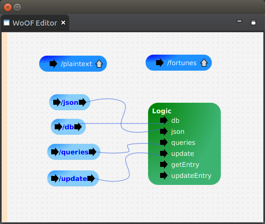

# OfficeFloor

OfficeFloor provides [inversion of coupling control](https://dzone.com/articles/inversion-of-coupling-control).

> Inversion of Control = Dependency Injection + Continuation Injection + Thread Injection

OfficeFloor completes inversion of control by adding two new paradigms:

* **Continuation Injection**: to inject functions to orchestrate application behaviour
* **Thread Injection**: to inject/select thread (pools) to execute particular functions
* *Dependency (State) Injection*: to inject objects for state into functions (currently only paradigm implemented by "inversion of control" frameworks)
 
In doing this, OfficeFloor is capable of running different threading models (e.g. both asynchronous single threaded and synchronous multi-threaded).  In actual fact, OfficeFloor opens up mixing the threading models within the application and even introduces ability for taking advantage of thread affinity to CPUs.

This follows OfficeFloor modeling people in an office environment:

* Office being an application that makes decisions on information
* Tasks within the Office as functions/methods (weaved together with *Continuation Injection*)
* Office employees/workers as threads that undertake the functions/methods (assigned via *Thread Injection*)
* Forms being the objects (manage state via *Dependency Injection*)

This allows OfficeFloor to better align to how business processes actually work:

* Workers synchronously working through tasks/functions of the processes
* Workers working asynchronously with each other

In other words, people think/behave synchronously but organise asynchronously.  Hence, both thread models are in play in modeling business processes.  Furthermore, OfficeFloor makes development of asynchronous applications easier.  This is achieved by allowing the developer to avoid asynchronous coding by having synchronous functions co-ordinated asynchronously (just like workers above).

Further to this, graphical configuration is used.  The configuration for the *officefloor* benchmark test is the following:

More information can be found at [http://officefloor.net](http://officefloor.net)

# OfficeFloor Benchmark Tests

OfficeFloor can use different HTTP server implementations that pass to OfficeFloor inversion of coupling control for request servicing:

* **officefloor-netty** : using Netty
* **officefloor-undertow** : using Undertow
* **officefloor-vertx** : using Vertx

OfficeFloor can also use various database clients.  These use the default HTTP server component provided by OfficeFloor:

* **officefloor-r2bc** : uses R2DBC.
* **officefloor-sqlclient** : uses Vertx SQL Client.

Having these comparisons allows developers to see the trade-offs in using different HTTP components and database drivers to handle HTTP request servicing.

As mentioned, OfficeFloor uses different threading models.  It does not inherit the threading model imposed by the HTTP component.  Hence, there are various threading models tested to see trade-offs:

* **officefloor-async** : asynchronous single-threaded
* **officefloor-micro** : synchronous multi-threaded model
* **officefloor-thread_affinity** : thread affinity of servicing each request only on one CPU

In "real world" applications ORMs are typically used:

* **officefloor** : uses JPA
* **officefloor-spring_data** : uses Spring Data repositories

# OfficeFloor real benefit

OfficeFloor is targeted at cloud and SOA/micro-service environments.   In these environments, applications do not operate in isolation with a single database.  Applications need to interact with multiple other services that result in:

* *synchronous threading models* : starving new requests of a thread if all threads in the pool tie up on a slow downstream system
* *aynchronous single threaded* : hard to write and hard to get right (so OfficeFloor allows synchronous code co-ordinated asynchronously for faster development and faster performance)

Furthermore, OfficeFloor handles this by using separate thread pools per downstream systems.  This way if a down stream system goes slow, only threads of that thread pool tie up.  Requests using other downstream resources continue to be serviced by the separated thread pools.

This leads to a more robust and responsive experience for the user.

Unfortunately, benchmark test coverage is yet to highlight this advantage of OfficeFloor.  However, if OfficeFloor can not perform as a typical web application, this robustness and responsiveness is mute against the sheer performance capabilities of frameworks managed by cloud elastic scale solutions.

